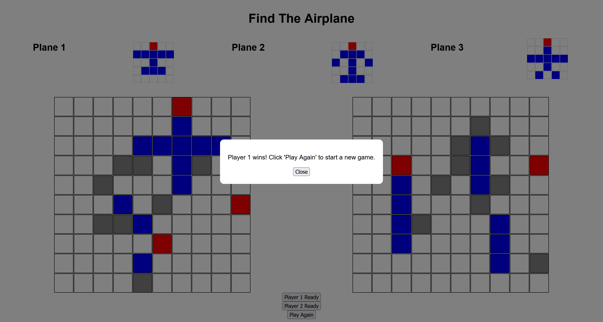

# FindtheAirplane
FindtheAirplane is a two-player turn-based game where players compete against each other. The gameplay involves three planes of different shapes, randomly rotated and placed on a 10x10 grid. The planes do not overlap each other. In each round, each player can click on an empty space on the grid. If the clicked space corresponds to the body of a plane, the square turns blue. If it corresponds to the nose of a plane, the square turns red. If it doesn't correspond to any part of a plane, the square turns gray. Players need to deduce the location of the plane's nose based on the revealed colors. The player who successfully identifies the nose of all three planes first wins the game.

It defines a module,
`web-app/FIndtheAirplane.js`,
for representing and playing games in pure Javascript.

A set of unit tests are written for this module,
`web-app/tests/FIndtheAirplane.test.js`.
The test set is not exhaustive, but tests the game-end conditions.

A front-end application is written to wrap the game module in a browser based
web app,
`web-app/browser/`

## Installation
* Clone the repository.
* Run `npm install` in the root directory to install dependencies (ramda, mocha, docdash)
